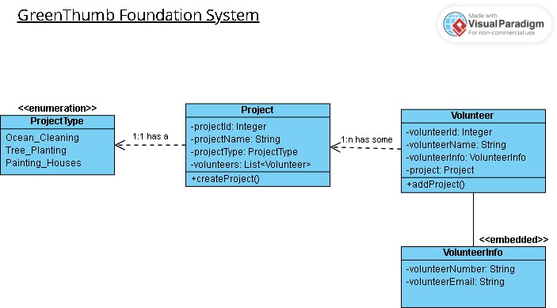

# GreenThumb Foundation

## 1. ProjectDescription

GreenThumb is my midterm project, and it is designed as a non-profit organization with a mission to protect the environment. This project has been a concept in my mind ever since I was tasked with creating a website for one of my college projects.

The program encompasses two main entities:

**Project:** Represents the various initiatives that the foundation is involved in. These projects fall into one of three categories: Ocean cleaning, tree planting, and house painting.

**Volunteer:** Encompasses individuals who volunteer for specific projects. The program includes their contact information.

## 2. Class Diagram

- Each project is associated with a project type, maintains a list of volunteers, and possesses a method to create new projects.

- Multiple volunteers can work on a single project, and each volunteer maintains contact information. The Volunteer class has a method to add a project to a volunteer.




## 3. Setup

1. Install the necessary programs: IntelliJ for coding and DBeaver for the database server. The project is created using Maven and Java 17, with the following Spring Boot dependencies: Spring Web, Spring Data JPA, and MySQL Driver.
2. Ensure that the application properties in IntelliJ are configured as follows:
```
spring.datasource.url=jdbc:mysql://localhost:3306/GreenThumb?createDatabaseIfNotExist=true&serverTimezone=UTC 
spring.datasource.username=root
spring.datasource.password=ironhack

spring.datasource.driver-class-name=com.mysql.cj.jdbc.Driver

spring.jpa.hibernate.ddl-auto=update

spring.output.ansi.enabled=ALWAYS

server.error.include-stacktrace=never
server.error.include-message=always
server.error.include-binding-errors=always
```
3. Populate the database using the `setUp()` method in the repository tests. Uncomment the `tearDown()` method to clear the database. Note that when using the teardown method, you may need to adjust some ID values in certain tests. I've added comments to indicate when this is necessary.
4. Install and use postman to test all the routs. 

## 4. Technologies Used


- **Java Version:** Java 17
- **Build Tool:** Maven
- **Spring Boot Version:** 3.1.4
- **Database:** MySQL
- **Persistence Framework:** Spring Data JPA
- **Web Framework:** Spring Web
- **Testing Framework:** JUnit
- **Validation Framework:** Spring Boot Validation


## 5.1 Control Layer Routes for Project

### Get all projects

```http
  @GetMapping("/projects")
```

- **Description:** Get a list of all projects.

### Get project by ID

```http
  @GetMapping("/projects/{projectID}")
```

- **Description:** Get a project by its unique ID.

| Parameter    | Type     | Description                       |
| :----------- | :------- | :-------------------------------- |
| `projectID`  | `integer` | **Required**. ID of the project to fetch. |

### Post a new project

```http
  @PostMapping("/projects")
```

- **Description:** Create a new project.

| Parameter | Type     | Description                       |
| :-------- | :------- | :-------------------------------- |
| `project` | `json`   | **Required**. The project data to be added. |

### Update project name

```http
  @PatchMapping("/projects/name/{projectID}")
```

- **Description:** Update the name of a project by its ID.

| Parameter    | Type     | Description                       |
| :----------- | :------- | :-------------------------------- |
| `projectID`  | `integer` | **Required**. ID of the project to update. |
| `projectNameDTO` | `json` | **Required**. The new project name. |

### Delete a project

```http
  @DeleteMapping("/projects/{projectID}")
```

- **Description:** Delete a project by its ID.

| Parameter    | Type     | Description                       |
| :----------- | :------- | :-------------------------------- |
| `projectID`  | `integer` | **Required**. ID of the project to delete. |


## 5.2 Control Layer Routes for Volunteer

### Get all volunteers

```http
  @GetMapping("/api/volunteers")
```

- **Description:** Get a list of all volunteers.

### Get volunteer by ID

```http
  @GetMapping("/api/volunteers/{volunteerID}")
```

- **Description:** Get a volunteer by their unique ID.

| Parameter    | Type     | Description                       |
| :----------- | :------- | :-------------------------------- |
| `volunteerID`  | `integer` | **Required**. ID of the volunteer to fetch. |

### Get volunteers containing a specific string

```http
  @GetMapping("/api/volunteers/str")
```

- **Description:** Get volunteers whose names contain a specific string.

| Parameter    | Type     | Description                       |
| :----------- | :------- | :-------------------------------- |
| `str`  | `string` | The string to search for in volunteer names. (Default: "john") |

### Create a new volunteer

```http
  @PostMapping("/api/volunteers")
```

- **Description:** Create a new volunteer.

| Parameter | Type     | Description                       |
| :-------- | :------- | :-------------------------------- |
| `volunteer` | `json`   | **Required**. The volunteer data to be added. |


### Assign a Volunteer to a Project

```http
  @PostMapping("/volunteers/{volunteerId}/assign/{projectId}")
```

- **Description:** Assign a volunteer to a specific project.

| Parameter | Type     | Description                       |
| :-------- | :------- | :-------------------------------- |
| `volunteerId` | `integer`   | **Required**. ID of the volunteer to be assigned. |
| `projectId` | `integer` | **Required**. ID of the project to assign the volunteer to. |


### Update a volunteer

```http
  @PutMapping("/api/volunteers/{volunteerID}")
```

- **Description:** Update a volunteer by their ID.

| Parameter    | Type     | Description                       |
| :----------- | :------- | :-------------------------------- |
| `volunteerID`  | `integer` | **Required**. ID of the volunteer to update. |
| `volunteer` | `json` | **Required**. The updated volunteer data. |

### Update a volunteer's email

```http
  @PatchMapping("/api/volunteers/email/{volunteerID}")
```

- **Description:** Update a volunteer's email by their ID.

| Parameter    | Type     | Description                       |
| :----------- | :------- | :-------------------------------- |
| `volunteerID`  | `integer` | **Required**. ID of the volunteer to update. |
| `volunteerEmailDTO` | `json` | **Required**. The updated email for the volunteer. |

### Delete a volunteer

```http
  @DeleteMapping("/api/volunteers/{volunteerID}")
```

- **Description:** Delete a volunteer by their ID.

| Parameter    | Type     | Description                       |
| :----------- | :------- | :-------------------------------- |
| `volunteerID`  | `integer` | **Required**. ID of the volunteer to delete. |

 
## 6. Extra Links

presentation: https://www.canva.com/design/DAFymWLu80U/CCapXfAX4mRdXvgOxHlUMg/edit?utm_content=DAFymWLu80U&utm_campaign=designshare&utm_medium=link2&utm_source=sharebutton

## 7. Future Work

In the future I'll be working in the frontend development of this project during the final project week.

## 8. Resources

- The resourses in the Ironhack student portal and the recorded sessions were my main sourse of information.
- https://www.youtube.com/watch?v=UI6lqHOVHic&ab_channel=LucidSoftware for basic knowlendge of the UML Class Diagram.
- https://online.visual-paradigm.com/ tools to create the daiagram
- https://www.baeldung.com/ for needed Spring boot documinations
- https://docs.spring.io/ for  needed Spring boot documinations
- https://www.canva.com/ for crating the presentation
